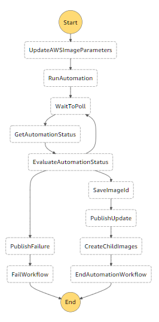

## GameStop AMI Factory ##

The AMI Factory is designed and built by GameStop to create machine images for use across environments and accounts.  By creating our own AMIs we are able to keep them available as long as needed to ensure reliability and compliance.  We will use the AMI Factory to "bake" in common configurations for a given server role.

This is accomplished using:

* [Systems Manager Documents](http://docs.aws.amazon.com/systems-manager/latest/userguide/automation-createdoc.html) for workflow and parameter definition
* [Systems Manager Automations](http://docs.aws.amazon.com/systems-manager/latest/userguide/systems-manager-automation.html) for executing the workflows defined in the documents
* [Systems Manager Parameters](https://docs.aws.amazon.com/systems-manager/latest/userguide/systems-manager-paramstore.html) for storing versioned values, used during the automations workflow
* [Step Funcions](https://docs.aws.amazon.com/step-functions/latest/dg/welcome.html) for orchestrating the workflow
* [SNS](https://docs.aws.amazon.com/sns/latest/api/Welcome.html) for Pub/Sub notifications


#### Currently Supports:

- Windows Server 2012 R2
- Windows Server 2016

#### Prerequisites

* **Subnet** - You'll need the ID for the subnet you wish to use to launch instances during the AMI baking process
* **EC2 KeyPair** - You'll need to create a KeyPair to use when launching instances during the AMI baking process


#### Deploying

The included deployment script (*deploy.ps1*) will ask you a few simple questions and then use your answers to deploy all of the AMI factory components into your account.  To use this script, you'll need to create an AWS PowerShell profile name *deploy* and configure it with API credentials and the desired region.

Once this is complete, execution is as simple as:

```powershell
    .\deploy.ps1
````


#### Repository Structure

* [templates](templates) - the CloudFormation templates that build the AMI Factory resources
* [sample-documents](templates) - working example documents for Foundation and Web Server AMIs
* diagrams - diagram images for supporting documentation


#### AMIs and Lineage

For each supported operating system the following AMI images will be created:

* **Foundation AMI** - This AMI represents a base image of the Operating System, created from an AWS AMI, with the minimum requirments for a GameStop Server
    * **Web Server AMI** - This AMI is created from the foundation AMI and feaures and other installations common web server roles using this OS


#### AMI Tagging

AMIs will be tagged with values that make it easy to determine when, how, and for what purpose it was created.

* **Execution ID** - Automation execution identifier
* **Source AMI** -  The AMI used to build this AMI.  For Foundation, this will be an AWS AMI, for Web Server it will be a Foundation AMI.
* **ServerOS** - The Operating Sysem installed on this AMI
* **GenerationEnvironmnet** - Since AMIs generated in production will be used throughout accounts, we want to track what account was used to create each AMI.  This will help distinguish between production AMIs and those created in pre-production accounts while testing improvements to the AMI Factory.


#### Automation

AMI Factory automation is accomplished using a StepFunctions and is triggered by via SNS subscription to AWS's ec2-windows-ami-update topic.

The StepFunction StateMachine and it's associated Lambda's can be found in the templates directory of this repository.  The StateMachine steps are diagramed below:

